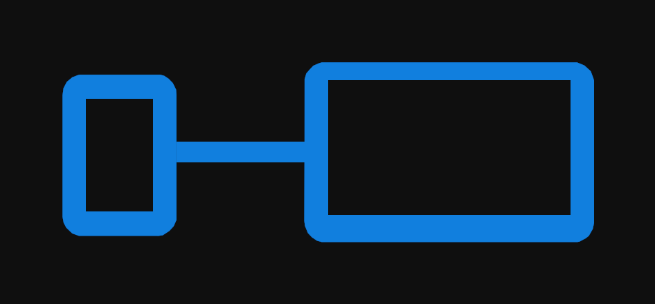

<p align="center">
  
</p>

<h1 align="center">readycast</h1>

Cast a phone's **secondary display** (Motorola's Ready For / desktop mode, or any
HDMI-monitor desktop) to an LG webOS TV, with low latency and audio.

LG's own screen sharing only ever captures the phone's **main** screen. Its cast
service mirrors display 0 and nothing else. Ready For does more than that (it
mirrors the main screen and runs a desktop/TV mode on a second display), but its
desktop-to-TV path fails to handshake with webOS televisions.

readycast captures the **second display** instead and sends it over the TV's native
casting pipeline, so the desktop lands on the big screen while your phone stays
free to use.

## How it works

```
secondary display ──► scrcpy-server (root) ──► H.264 ──► LG cast pipeline (RTP) ──► TV
```

The phone encodes **once** with the hardware encoder; the frames are handed to the
Connect SDK's RTP layer, which is the same encrypted transport LG's own app uses.
Nothing is re-encoded and the desktop is never rendered on the phone.

## Install

Grab the APK from the [releases page](../../releases) and install it on your phone.
Enable installation from unknown sources if your phone asks. Debug builds are provided
as-is. There is no Play Store version.

To build it yourself instead, see [Building](#building).

## How to use

1. Install the APK from the [releases page](../../releases) and launch **readycast**.
2. Pick a source:
   - **Main display (phone)**: mirrors the phone screen. No root needed.
   - **External display (desktop)**: mirrors the desktop on your second display.
     Needs a second display to exist: connect a real monitor, or use a **dummy HDMI
     display adapter** (an unpowered HDMI plug is enough) to keep the desktop alive
     with nothing plugged into it.
3. Set **Resolution / Bitrate / FPS** if you like. These apply when you next start.
   For 1080p60 desktop text, 15 to 25 Mbps is worth it; the default 6 Mbps suits video
   more than code.
4. Tap **Start mirroring** and accept the screen-capture prompt. Accept the pairing
   prompt on the TV the first time.
5. Tap **Stop mirroring** when you're done. Closing the app from the task manager also
   stops the capture server; minimising it does not, so you can switch away mid-cast.
6. The remote buttons (volume, mute, power) work whenever the TV has been
   discovered. Start mirroring once at least.

### Notes

- Casting keeps running while the app is minimised. Reopening it shows the current
  state.
- A completely frozen desktop keeps the stream alive, but a *moving* one looks
  noticeably smoother. The hardware encoder only spends work on frames that changed.

## Building

Requires the Android SDK, a JDK, and network access on the first build.

```bash
git clone <this repo> readycast
cd readycast/android-app
./build-debug.sh          # or build-debug.bat on Windows
adb install -r app/build/outputs/apk/debug/com.serifpersia.readycast-1.0.0-debug.apk
```

For a signed release APK, generate a keystore once (it is **not** committed, so every
build machine makes its own):

```bash
keytool -genkeypair -v -keystore readycast-release.keystore -alias readycast \
        -keyalg RSA -keysize 2048 -validity 10000 \
        -storepass readycast -keypass readycast
```

Then `./build-release.sh` (or `.bat`). Without a keystore the release build still runs
but produces an unsigned APK.

The build first runs `fetch-deps.sh` / `fetch-deps.bat`, which downloads the two
binary dependencies that **cannot be redistributed** (LG's `lgcast` jar and LG's
GStreamer natives) from the Connect SDK repository at a pinned commit. Everything
else is in the repository, including the vendored Connect SDK source and the scrcpy server.

### Root or Shizuku

The external display option needs to run the capture server with shell privileges. It
uses whichever is available:

- **Root (Magisk)**: used automatically, nothing to configure.
- **Shizuku**: install Shizuku, start it once via wireless-debugging pairing, then
  grant readycast permission when it asks. It is used automatically when root is absent.

Shell privileges are enough: that is how scrcpy captures a secondary display over adb.

### Requirements

- Android 8.0 (API 26) or newer
- Root (Magisk) **or** Shizuku for the external display option
- Phone and TV on the same network; 5 GHz Wi-Fi above ~20 Mbps

## Credits

- **[scrcpy](https://github.com/Genymobile/scrcpy)** (Genymobile, Apache-2.0). The
  bundled `scrcpy-server` binary captures the secondary display with shell privileges,
  which is what makes casting the desktop possible at all. We ship the binary
  unmodified.
- **[Connect SDK](https://github.com/ConnectSDK/Connect-SDK-Android-Core)**
  (Connect SDK, Apache-2.0), vendored under `android-app/connectsdk/`. Provides
  device discovery, SSAP pairing, the encrypted RTP transport and the TV remote
  capabilities. **Our fork adds**: injecting pre-encoded frames in place of its
  `MediaProjection` capture, and allowing a start request without a projection
  intent. Those edits are marked in the source.
- **[Shizuku](https://github.com/RikkaApps/Shizuku)** (RikkaApps, Apache-2.0). It is optional and
  gives non-rooted devices shell privileges so the capture server can run.

LG's `lgcast-android-lib.jar` and its GStreamer build are fetched at build time and are
**not** covered by this project's license.

## License

Apache License 2.0. It uses the same terms as the Connect SDK and scrcpy code this builds on.
See <https://www.apache.org/licenses/LICENSE-2.0>.

The binaries downloaded by `fetch-deps` are excluded: they remain the property of
their respective owners and are only fetched, never redistributed here.